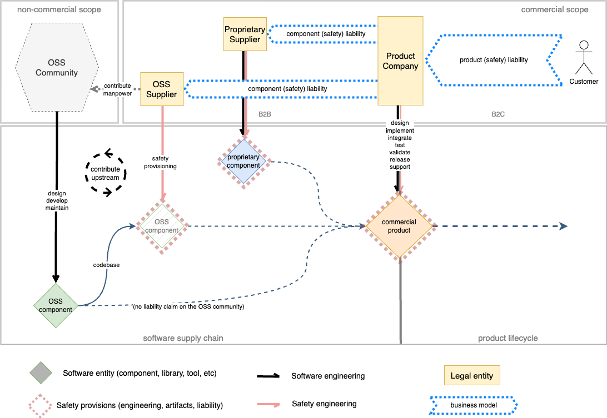
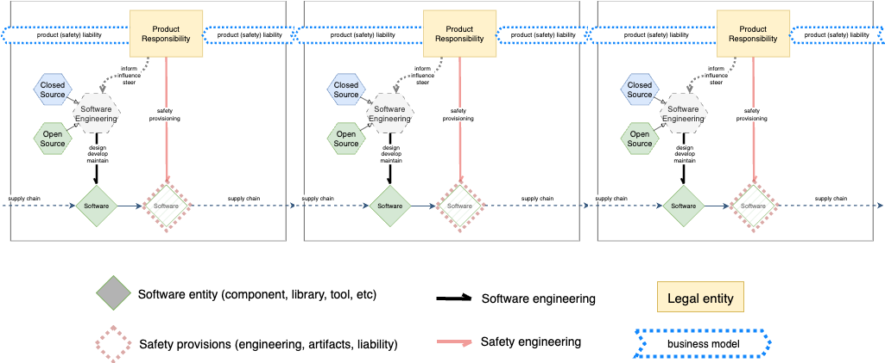

# Safety Software Supply Chain (aka: voila, there is your business model!)

There exists a long-standing and seemingly intractable conflict between the world of commercial Product Safety and the Open Source development model. It is commonly stated that Open Source software is inherently unfit for deployment in systems that have to adhere to safety regulations, due to the instrinsically uncontrolled and aimless nature of Open Source development practices. While such allegations are well worth investigating in detail and will often be found not to hold water, there is a bigger-picture viewpoint to be taken on this issue: similar to Open Source enabling the divorce of IP-based from engineering-based business models in the past decades, it can now enable a differentiation between IP-based and liability-based business models. With the right mindset and methodology, there is no unconditional need to co-locate IP ownership of a codebase with taking on safety-liability for that same codebase. Rather, safety engineering and the associated liability coverage can become another dimension for models of commercial engagement.

This text explores this thought by shining a light on the core value proposition of the Open Source development model, and putting that in relationship to the engineering, IP and liability dimensions that are the motivating factors for designing software supply chains.

## Product Safety, IP-based business models and the advent of Open Source development models

Product safety is the responsibility of the product-selling organization (OEM), which has to be able to defend their product safety in a court of law, if necessary. This involves being able to prove that state of the art best practices have been followed during product development, by all involved parties. Safety engineering practices, methods and standards exist to guide the actual functional aspects of the development of safe products - but they also are the underpinning of a liability claim chain that is put in place as OEMs subcontract product components to suppliers.

Traditional supply chains deliver closed/proprieraty components. Due to the opaque nature of such closed-source components, the integrator needs detailed documentation of expected behaviours and valid integration context (compare "assumptions of use"). To be able to prove that components are developed according to best practices, suppliers are required to create and provide extensive evidence of development process and engineering quality metrics.
The supplier-integrator relationship is codified via elaborate contracts, determining the extent and limits of liability in case of product failures. The aim is to set up a line of defence against related litigation by proving that each part of the supply chain has performed their roles according to the rules and expectations laid down in bespoke standards and best practices (usually, industry-specific safety standards derived from the overarching IEC 61508).

One aspect that is noteably absent from this constellation, but is nonetheless today perceived to be almost an implicit co-dependency in the supplier-integrator relationship, is intellectual property (IP) rights on the supplied components: the thing that is commonly "sold" is IP or usage rights of the code/component in question, with the intermingled assumption that it couldn't possibly be any other way due to the suppliers perceived need to "control" the quality and content of the codebase in question.

The (belated) advent of open development models to safety-relevant industries fundamentally challenges this co-dependence: open source represents a fundamental divorce between software engineering (and the resulting IP), and any commercial/contractual engagements between legal entities.

## Detour: what is Open Source, actually? What kind of Open Source are we actually talking about?

Open Development models have been around for more than 30 years, but there still exist major misconceptions about why it actually is important, and how to translate that into business drivers. One of the key misunderstandings is that Open Source is primarily about the ability to just "download and use software for free!". While this is a necessary condition, it only highlights the result of a process. It is this open development process that is the heart of the Open Source model.

There are two fundamental ways to relate to Open Source software: use it, and engange with building it (yes, there is the option to ignore it, but that's not what this is about after all).

Today, __almost every computer system runs on or with Open Source software__. Like the proverbial tip of the iceberg, Open Source usage extends to many people's desktop computing experience - via the Firefox browser, the Thunderbird eMail client, the LibreOffice suite or a myriad of other applications and utilities. Underneath that water line exist the Linux kernel, a huge ecosystem of assorted libraries and utilities, docker and kubernetes stacks, programming languages/compilers/tools and much more, which together form the backbone of almost every piece of digital infrastructure one the planet. Without Open Source usage, the IT world would literally stop in a heartbeat.

All of this is maintained and evolved by __people and organizations who engage with buiding Open Source software__. While there are an astonishing number of absolutely critical components that are woefully underfunded and only kept alive via the dedication of a few individuals (e.g. [curl](https://lwn.net/Articles/1034966/)), the majority of critical Open Source development is driven by companies who dedicate developer resources to the projects that are strategically relevant to their business.

This engagement model has some prerequisites, and tends to produce a certain pattern of results. A successful Open Source project or community usually only forms around a sufficiently generic problem. An overly specialized concern is - by definition - only relevant to a small number of parties, who usually are in competition with each other about who can offer the best specialized solution. This is not a constructive base for an open, collaborative development process. In contrast, there exist many problems that are ubiquitous and that are inherent to many kinds of IT solutions. Kernels, compilers, core libraries, protocol stacks, middleware, software orchestration, virtualization, etc - such infrastructure-type concerns are predestined for the Open Source development model, as they are of relevance to almost every organization that builds IT systems. At the same time, such components are non-differentiating with regards to the user or consumer of the final product - unless they do not work properly. As infrastructure-style software is often hard to get right on an engineering level, homebuilt solutions for general conerns tend to be a lot less mature and robust than open solutions built by a large community of subject matter experts, with a development model that puts focus on engineering quality instead of meeting deadlines and managerial metrics.

Once such an overarching concern is identified by a sufficienaly large number of entities, and they actively engage in an Open Source development project for building a solution, there is a chance for the following to emerge:

- Best-in-class solutions, built to very high standards, by very competent engineers (if the participating companies understand the strategic relevance of the topic in question); Open Source projects don't usually suffer theoreticists gladly, and are very goal- and engineering-driven. This means that they are hard to "steer" from a management perspective, but ideally the project culture will evolve (in their own time and cadence) towards well engineered solutions that incorporate the cumulative experience and learning from a multitude of high-stakes contributors.
- A crystallization point for a software (also commercial software) ecosystem; frameworks, infrastructure and protocols that are used by a large number of organizations can form a stable and robust foundation for building value-add and differentiating products and services - that automatically address the entire user base of the ecosystem. This is how software business can scale. Conversely, industries that insist on competing on and continually, locally re-inventing their own foundations, can never achieve any kind of scaling user base for higher-scale offerings.

The takeaway is that most of the best engineered, widely deployed and mature software in use today is built with Open Source development models. Open Source is ideally suited for building common-concern software infrastructure. It works best when organizations recognize the strategic relevante of this infrastructure for their business, are willing and able to actively drive the evolution of Open Source projects together with all other stakeholders, and deploy and use the resulting software in their products and services.

As always, even if all of these factors align, real success remains a matter of timing, luck and perseverance.

In the case of successful ecosystem take-off, it is important to notice that the commercial viability of ecosystem-based offerings (by commercial entities) is independent from the ownership of the core ecosystem IP (which usually resides with the Open Source project and/or the associated foundation). As a matter of fact, some of the most valuable companies in the world have built their business on software infrastructure IP that they do not themselves own (compare Microsoft Azure, Amazon AWS, Google GCP, Facebook).

It is also worth pointing out that when integrating mature Open Source components into a product or solution, the Open Source component "usually is right" about usage patterns, API design, functional scope etc. - Open Source has to cover a broad spectrum of usage scenarios to attract large amounts of users (see above), and at the same time the experience of many of the power users directly informs the design and evolution of the component. To efficiently integrate Open Source it is wise to design a system to fit these components, even if that means modifying aspects of one's own workflow, data model, API etc. The financially worst possible thing to do is fork and modify existing Open Source code that has a lively community - because the fork will consume substantial developer capacity simply to stay in sync with the original/upstream project over time, with the added burden of having to maintain whatever changes were made to the fork. Ignoring upstream changes means custom-engineering any security fixes and other fundamental improvements to the code base, while forgoing the potential ecosystem scaling effects enabled by multiple player all working with the same code base. For a commercial player, there is almost no scenario where forking existing Open Source code is profitable in the mid to long term.
You would not create and run your own factory for manufacturing 8.27mm machine screws, just because your engineering calculations said that this was the optimal strength for your product application.

## Open Development Models - engineering dimension

A product company (OEM) has to proactively manage their supply chains, regardless of the type of input that is being provided. Similarly to a big tech company strategically entering into joint r&d arrangements for some novel material or production process, it is necessary to make decisions about which parts of a product software stack are of strategic importance, and which level of engagement and involvement is the best fit for the components in question:

- A highly bespoke, solution-specific piece of functionality is likely close to the core value proposition of a company, and as such not a good candidate for offloading into a supply chain.
- In contrast, a fundamentally important piece of software infrastructure (e.g. a communication middleware framework) that is crucial for the functioning of the product, but covers a more generic functional concern, is often not a good place to focus core engineering efforts; such components are good candidates for being offloaded to outside supply chains.

Convential (hardware) supply chains involve physical manufacturing and distribution, therefore usually imply commercial entities who make that their business model. Proprietary software supply chains operate in a similar way - while distribution has been going online even in more traditionally minded industries, the *manufacturing* of software still very much is considered to be something that upstream commercial entity do and then sell to product integrators (aka "Software-as-a-product").

The key impact of Open Source is that it offers an additional strategic dimension for how to do software supply chains: the estabished make-or-buy paradigm effectively is a binary decision between 100% and 0% engineering involvement. Open Source transforms this into a continuum, making possible more fine-grained decisions about the level of engineering involvement with one's core strategic software infrastructure: from having a limited amount of engineering time spent observing a project, occasionally raising issues and contributing bug fixes, to leading the implementation of a major piece of functionality by providing the core contributors and maintainers of a project, Open Source offers the choice to get exactly as involved as is appropriate for a specific part of a supply chain. In accordance with what was stated in section *Detour: what is Open Source, actually? What kind of Open Source are we actually talking about?*, the smaller the potential user base for a Open Source project is, the smaller the potential to attract other contributors, and the larger the resource burden and responsibility that rests on the participants.

A common Open Source enabled business model is the outsourcing of this engineering involvement. "Open Source Companies" offer engineering services, development resources and even end-user support for Open Source software components or systems where their customers want to partake in the benefits described above, but do not themselves have the inclination to build of the needed skills and capacity. This typically is a great way to deal with Open Source components which are fundamental (e.g. "Linux Distribution"), but not themselves a key strategic aspect of a product offering.

## Open Supply Chains - intellectual property dimension

From a intellectual property (IP) point of view, using Open Source software in commercial settings is conceptually simply and non-surprising: software assets come with a license or contract. Product integrators have to fullfill the terms and conditions of the contracts of all the components that they use in their commercial offerings. This is not a new concept, and applies equally to closed and Open Source components.

As always there exist a number of caveats and gotchas in this area:

- some license/contract terms are in contradiction with each others, so care has to be taken to ensure license compatibility
- custom/non-standard Open Source licenses usually are a nightmare to manage for this reason, which does not prevent some organizations from coming up with new ones
- not every Open Source project correctly declares their licensing (and there are cases where this is actually a complex problem, for various reasons)
- it is not always obvious or explicit where IP ownership of Open Source assets actually lies - this is where Open Source Foundations (e.g. Eclipse Foundation) come in to provide robust legal bylaws and procedures for their projects
- correctly dealing with these things requires complete tracking of software supply chains (which should be a no-brainer for any product organization anyways, but apparently isn't always)

There is much written and said about this topic already, so we will not delve into it further.

## Open Supply Chains - liability dimension

Product liability is a major consideration for companies that build, integrate and sell commercial products, gouverned by major bodies of legislation and litigation law. This is especially relevant for products that have a the potential to harm human beings, and are therefore subject to safety engineering standards and related certification.

As has been laid out above, conventioal software supply chain arrangements are effectively bundle deals, where a supplier sells usage and distribution rights to his IP, potentially associated engineering service support, plus some form of liability ownership or safety guarantees. We have discussed the separation between IP ownership and engineering involvment, and how the Open Source development model allows for these two aspects to be controlled independently from each other, enabling a new dimension of business models besides IP ownership.

In the same way, we can consider liability a dimension separate from code ownership (IP) or software engineering. Formal handling of liability in a supply chain is build on safety engineering standards and associated documentation regarding the supplied component. There is no obligatory connection between contractually taking on the task of doing safety engineering&documentation on a code base, and owning the IP for that code base. This enables the same shift from a binary make-or-buy situation (0% liability or 100% liability) to a potentially more fluent gradient:

- For open source components that are foundational to a product value chain, an integrator can decide that they are going to directly embrace the safety responsibility. Because of the open supply chain, the integrator can know anything and everything about these components, and has full visibility of any work that might be required to get component includable into a safe system. This implies a very direct, engineering-level involvment in those projects, because any changes and improvements made to components need to be done upstream, to be sustainable in the long term. Deep engineering involvement also will be required to be able to make informed statements about a codebase with regards to its safety properties, when used within a safety context.
- Opening up a new dimension for supplier-customer relationships, safety engineering and taking of liability can also be the value proposition of commercial engagements. Already today, OEMs are not really paying software suppliers specifically because they have the best possible IP (code) - any code that fullfils product requirements would do, and typically there is more than one solution for a given technical problem. Rather, the commercial relationship is about getting things working in time and budget (engineering), and having a well-defined chain of responsibility that can be pulled into a courtroom, should the need ever arise.

This diagram pulls together the commercial - non-commercial dimensions of a Open Source supply chain, with a focus on highlighting safety engineering and liability allocation:

SIDEBAR: This kind of business model is already being adopted by organizations ranging from small to large: Codethink, Excide, Ferrous Systems, RedHat, just to name a few.

There is a fundamental shift required for this model to become more visible and gain mainstream traction: safety standards and methodologies need to understand, embrace and adapt to Open Source development models. Convential approaches posit a hermetically closed development environment, with complete control over what goes into a code base and how that is controlled by processes - not least because the resulting component might then be transferred to an integrator as a black box with no visibility of the original development practices, design, or testing.
Open development models turn this assumption on its head: while the path to contributing code cannot be limited to specific organizations, the actual processes of code review, changes being accepted and merged, tests and associated test results, build and release infrastructure, etc. all are entirely open and visible to everyone. So an Open Source aware safety methodology needs to shift focus away from controlling "Roles and Responsibilies" to visibility of process, changes, decisions, as well as evidence that a code base actually measures and meets any quality goals that are relevant and required by an integrator.

Supply chains usually are multiple levels deep - in software, this is usually driven by libraries requiring other libraries, that again require libraries, etc. This is the practical effect of successful software reuse, plus the recognition that there is nothing to be gained be re-implementing widely used standard functionality (e.g. a json parser). However, this practice poses challenges to supply-chain handling (license compatibility tracking, security management) and is a key challenge for safety engineering. In principle, the liability supply chain can be schematized to enable multi-stage layering of safety engineering:

In practice, a combination of suppliers for safety modules might enter into cooperation relationships that enable such a chain of liability - but this is likely not a practical approach for large dependency graphs that are standard for more complex software components. Approches like STPA (System-Theoretic Process Analysis) by Nancy Leveson might be used to analyze and limit the scope safety engineering and focus efforts onto system parts that are actually relevant to ensure safe outcomes.

__Conclusion:__ Similar to making a decision about which technology is core to a product companies value proposition, and from that draw a line of engagement between direct engineering involvment in upstream projects (versus finding and funding a supplier), an OEM can decide which technology is sufficiently relevant to directly take on the liability (versus finding a supplier to take care of the liability and associated safety engineering efforts). With sufficient support by safety methodologies and practioners, safety engineering can become a dimension of strategic software supply chain management, and open up a corresponding opportunity space for Open Source enabled business models.

---
