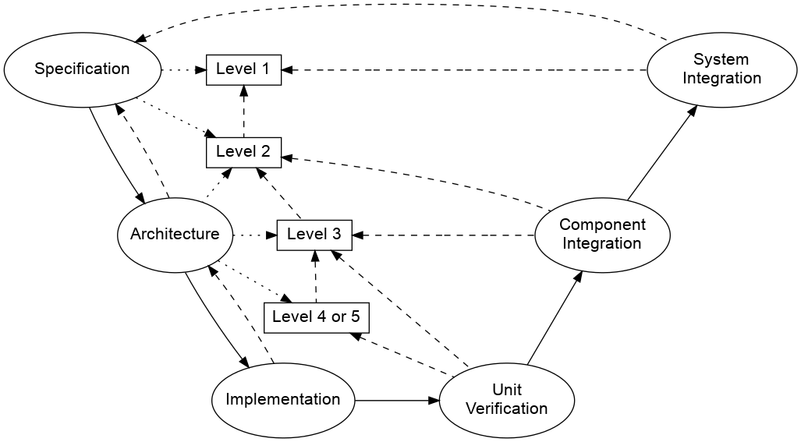

:doctype: book
:author_name: Paul Albertella
:sectnums!:
:chapter-label:
:xrefstyle: short

= Software Development Process Model for RAFIA

== Introduction

This document describes a process model for software development for safety-relevant systems using System Theoretic Process Analysis (STPA). It focuses on system development approaches that emphasise the reuse and integration of software that has already been developed, specifically Free and Open Source Software (FOSS). The description uses some ISO 26262 terminology for illustration purposes, but the principles and overall process are intended to be generally applicable.

Refer to the link:#glossary[Glossary] for the meaning of the terms in _italics_ .

== Activity layers

Software development can be modelled using three layers of activity:

* Specification
* Architecture
* Implementation

Each of these layers also includes <<Verification and Validation>> activities.

These layers represent a hierarchical flow of information at successively greater levels of detail, and correspond to the development phase model used in ISO 26262 and other standards. However, for this model there is an explicit expectation that the activities associated with these layers will be undertaken iteratively; the outputs of one layer's activities may be refined or extended following work on dependent activities in the next layer down, often reflecting improved understanding gained by performing those activities.

*Specification* activities are driven by communications between designers and stakeholders. The inputs are elicited as part of these activities, amd may be poorly defined and distributed between different
stakeholder's mental models, although inputs relating to existing materials may have more detailed specifications. The outputs are: a description of the _system under development_ and the _system(s)_ that incorporates it, in sufficient detail to allow analysis; verification and validation criteria for the outputs of the _Specification_, _Architecture_ and _Implementation_ activities; plus any additional expectations relating to these.

*Architecture* activities are driven by communications between designers and developers. The inputs are the results of _Specification_, the team capabilities, and the desired characteristics of any tooling or
materials that may be used. The outputs include both verification and validation criteria for the _system under development_ and documentation describing: the components of the software; the interactions between them; and any additional expectations relating to these, or to the tooling or materials to be used in _Implementation_.

*Implementation* activities are driven by communications between developers. The inputs are the results of _Architecture_ and _Specification_, and the available tools and materials. The output is the system under development, together with the tools, tool integrations, tool configurations and any other material required to construct, verify and validate it.

== Levels of abstraction

Activities in the first two layers result in architecture, design and test documentation created using STPA (together with other methods) and specifying the system at different levels of abstraction. These are organised in a hierarchy; higher-numbered levels represent abstractions that describe the system - and specify its required properties and behaviour - at increasing levels of detail.

The levels of abstraction are defined following these guidelines:

* Level 1 is at the level of the _target system context_
** The _system boundary_ is the at the level of a _system_ that contains or incorporates the _system under development_
** In ISO 26262 terms, this will typically correspond to an _Item_ or the assumed _Item_ context of a _SEooC_. It Identifies inputs and outputs exchanged with other _Items_, the driver, etc
* Level 2 is at the level of the _system under development_
** The _system boundary_ is that of the applicable _Element_. For a software _Element_ or _SEooC_ this a purely functional abstraction
*** Describing the most important logical / functional components of the _system under development__ and their responsibilities
* Level 3 is at the software _Element_ level, with concrete components
** The _system boundary_ is the _Element_
*** If the _system under development_ is a software _Element_ or _SEooC_, then this will be the same as the _system boundary_ at Level 2
** It distinguishes concrete software components of the _Element_
*** Components corresponding to software packages or repositories
*** Should have a complete inventory of all software components and dependencies at this level
* Level 4 is at the level of one or more software components within an _Element_
** This level is only needed when component interactions identified at level 3 require further analysis to identify required mitigations, behaviour or properties
** The _system boundary_ is a subsystem or subset of the _Element_'s functionality
*** Focussing on interactions associated with one responsibility (or set of related responsibilities)
*** May distinguish individual binaries within a software component (executables or libraries)
*** May include sub-divisions of interfaces specified at Level 3
* Level 5 is at the level of _controllers_ or _controlled processes_ within binaries
** This level is only required when a binary has more than one _controller_ or _controlled process_ responsibility
** The _system boundary_ is a subset of components associated with a given _controlled process_
*** May include related _controllers_ and/or _controlled processes_

The required behaviour of the _system under development_ is specified at each level using control structures and _constraints_, which are the result of analysis using STPA. Control structures identify system components, in _controller_ and _controlled process_ roles, and the interactions between them. A number of distinct control structures may be specified at the same level, and control structures at higher levels may provide a more detailed description of a _controller_ or _controlled process_ at the preceding level.

Test cases are also defined at each level using a _scenario language_. These should include _fault injection_ scenarios to verify the effectiveness of verification measures, both offline (to detect systematic failures during testing) and online (to trigger mitigations or safety mechanisms during system operation).

[[verification]]
=== Verification and Validation

Each layer also includes _Verification_ and _Validation_ steps as part of activities, or as planned activities to evaluate the results of a set of activities. The recorded results of these actions are important outputs of the associated activities, which are used to determine when an activity is complete.

*Verification* activities evaluate the results of an activity using criteria specified for its particular context. These should be automated wherever possible and may include tests of the implemented system (or its components) and static analysis of source, as well as human review of an output against a set of criteria.

*Validation* activities evaluate the outputs of an activity (or set of activities) to determine whether they achieve a set of objectives specified in a different context. These activities more typically involve human review, and the outputs evaluated may include the criteria used for verification and the results of verification activities. The evaluated objectives might be:

* _constraints_ specified at a different level of abstraction
* requirements specified in a preceding activity layer
* the expectations or intent of stakeholders (when validating _Specification_ outputs)
* the requirements of an applicable standard or regulation

<<vmodel>> illustrates this using the V-Model, showing how different activity layers may contribute to documentation at successive levels of abstraction, and how these inform verification and validation at different layers. See below for a diagram key.

[[vmodel]]
.Activity layer model

* Ellipses represent different _Activity layers_ and the associated _Verification and validation_ activities.
* Boxes represent the outputs of _Specification_ or _Architecture_ activities at different levels of abstraction.
* Solid arrows show the flow of dependency between development activities on the left, and verification activities on the right.
* Dashed arrows show verification or validation against the _Specification_ or _Architecture_, and the corresponding outputs at different levels of abstraction. This includes:
** Document reviews to e.g. validate that the _Architecture_ fulfils the expectations documented in the _Specification_
** Review of documents to e.g. validate consistency between different levels of abstraction
** Review of test implementations to validate that they fulfil the intent of the specified test scenarios
** Testing and static analysis of the _Implementation_ at different layers to verify its behaviour and evaluate other criteria (e.g. code quality metrics)
* Dotted arrows show the activity layers that contribute to architecture, design and test documentation at different levels of abstraction.

== Glossary

The following terms, when used in _italics_ in this document, have a specific connotation, which is described here.

[cols="2,1,6",options="header"]
|===
| Term | Source | Definition
| *constraint* | `STPA` | Unambiguous criteria pertaining to the behaviour of a _system_, _controller_ or _controlled process_ that must be satisfied in order to achieve a goal. In STPA, the applicable goals relate to the prevention or mitigation of _hazards_.
| *controlled process* | `STPA` | A system process that the system's designers wish to control. At the highest level of abstraction, this will normally correspond with a physical process (e.g. a braking system), but in a software architecture it could represent a subsystem, a functional block or an instance of a program in execution.
| *controller* | `STPA` | A system component that is responsible for enforcing _constraints_ on the behaviour of the _system_ by issuing control actions to a _controlled process_ (or another _controller_).
| *Element* | `ISO 26262` | A _System_, component, hardware part, or software unit, including a _SEooC_
| *environment* | `STPA` | The set of components (and their properties) that are not part of the _system_, but whose behaviour can affect the _system_ state.
| *hazard* | `STPA` | A _system_ state or set of conditions that, together with a particular set of worst-case _environment_ conditions, will lead to a loss.
| *Item* | `ISO 26262` | A _System_ or combination of _Systems_, to which ISO 26262 is applied, that implements a function or part of a function at the vehicle level
| *loss* | `STPA` | An unacceptable outcome associated with the operation of a _system_, involving something of value to its stakeholders (users, producers, customers, operators, etc). In a safety context, this normally means loss of life or injury to persons.
| *SEooC* | `ISO 26262` | Safety element out of context - a safety-related _Element_ which is not developed in the context of a specific _Item_
| *scenario language* | `subplot` | Language used to describe a set of criteria for verifying software behaviour, in a way that can be understood by human stakeholders and parsed by software tools. Examples
include https://en.wikipedia.org/wiki/Cucumber_(software)#Gherkin_language[Gherkin] and https://doc.subplot.tech/subplot.html#subplot-input-language[Subplot's input language].
| *System* | `ISO 26262` | A set of components or subsystems that relates at least a sensor, a controller and an actuator with one another;
| *system* | `STPA` | A set of things (referred to as system components) that act together as a whole to achieve some common goal, objective, or end
| *system boundary* | `STPA` | An abstraction that separates a _system_ from its _environment_. System inputs and outputs cross the system boundary.
| *system under development* | | The _system_ that is the subject of the development process; this is typically a software _system_ (_Element_)
| *target system context* | | The *system* or *systems* (or a specification thereof) within which the *system under development* is intended to operate.
| *Work product* | `ISO 26262` | Documentation resulting from one or more associated requirements of ISO 26262
|===

Sources are as follows:

* `ISO 26262`: https://www.iso.org/obp/ui/#iso:std:iso:26262:-1:ed-2:v1:en[ISO 26262 - Part 1]
* `STPA`: https://psas.scripts.mit.edu/home/get_file.php?name=STPA_handbook.pdf[STPA Handbook] particularly Appendix F.
