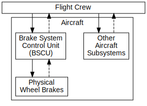

:sectnums:
:chapter-label:
:xrefstyle: short
:table-caption:

ifdef::env-github[]
:table-caption: :information_source:
endif::[]

:toc:

= STPA Glossary

This document provides definitions and an overview of the key concepts in System Theoretic Process Analysis (STPA).

The boxed text sections are extracts from the https://psas.scripts.mit.edu/home/get_file.php?name=STPA_handbook.pdf[STPA Handbook] ("the _Handbook_"), which is copyright © 2018 by Nancy Leveson and John Thomas.

:sectnums!:
[[system, System]]
== System

[cols="<1", stripes=all]
|===
| A system is a set of components that act together as a whole to achieve some common goal, objective, or end. A system may contain subsystems and may also be part of a larger system.
|===

The _system_ is an abstraction that defines the scope of our analysis. It must, by definition, have a purpose or set of goals.

A system is defined by a _boundary_ and may have _inputs_ and _outputs_ that cross this boundary. Factors that are external to the system, but which may nevertheless influence its state, are referred to as its _environment_.

[[boundary, System Boundary]]
=== System boundary

The boundary of the <<system>> is an arbitrary construct that we define for the purposes of analysis. It may or may not correspond to a physical boundary, or a concrete separation in a software context (e.g. between process or threads of operation, or between binary components), and may only indicate a division of responsibility.

[cols="<1", stripes=all]
|===
| [T]he most useful way to define the system boundary for analysis purposes is to include the parts of the system over which the system designers have some control
|===

[[environment, Environment]]
=== Environment

Factors that are external to the <<system>>, but which may nevertheless influence its state, are referred to as its _environment_. This might be a physical environment if the system under analysis is a vehicle, but it can describe anything that is outside the defined boundary that may be relevant to the goals of the system.

For a software component, this might include the processor hardware that it executes upon, or other hardware devices it interacts with, or the operating system software if the system under analysis is an application.

[cols="<1", stripes=all]
|===
| The environment is usually defined as the set of components (and their properties) that are not part of the system but whose behavior can affect the system state.

The concept of an environment implies that there is a boundary between the system and its environment.
|===

[[loss, Loss]]
== Losses

[cols="<1", stripes=all]
|===
| A loss involves something of value to stakeholders. Losses may include a loss of human life or human injury, property damage, environmental pollution, loss of mission, loss of reputation, loss or leak of sensitive information, or any other loss that is unacceptable to the stakeholders.
|===

Losses represent outcomes that we (or stakeholders) wish to avoid.

They should be at the highest level of abstraction and focus on the most critical aspects of the <<system>>. For safety, these will normally focus on loss of life or human injury, but they may also included losses relating to other system design goals, such as security, performance, reliability or usability.

.Example Losses
[cols="<1", grid=none, stripes=all]
|===
| L-1: Loss of life or injury to people
| L-2: Loss of or damage to vehicle
| L-3: Loss of or damage to objects outside the vehicle
| L-4: Loss of mission (e.g. transportation mission, surveillance mission, scientific mission, defense mission, etc.)
* L-5: Loss of customer satisfaction
|===

.Tips to prevent common mistakes when identifying losses
[cols="<1a", stripes=all]
|===
| * Losses should _not_ reference individual components or specific causes
* Losses may involve aspects of the <<environment>> over which the system designer or operator has only partial control or no control at all.
* You should also document any special considerations or assumptions made, such as losses that are explicitly excluded
|===

[[slh, System-level Hazards]]
== System-level Hazard

[cols="<1", stripes=all]
|===
| A hazard is a system state or set of conditions that, together with a particular set of worst-case environmental conditions, will lead to a loss
|===

System-level hazards are states or conditions of the <<system>>, as opposed to states of the <<environment>> or individual <<component>> failures. These are states or conditions that need to be _prevented_, not states that the system must normally be in to accomplish its goals.

This does _not_ mean that we can exclude external factors from our analysis: rather, we should focus upon how the <<system>> under analysis can be involved in managing or controlling the associated risk. Understanding how the <<system>> may detect and respond to an external factor may be a key part of this.

If we _cannot_ control or manage a hazard as the designer or operator of our <<system>>, then it may be out of scope for our specific analysis. However:

* It is still important to document such hazards, as the associated risk may need to be managed by some other means
* Even if a hazard cannot be prevented, it may still be possible to reduce the severity of the consequent loss(es) or the probability of it occurring.

It is important not to confuse hazards with failures, or with system functions that have not been implemented as specified. Hazards _may_ result from a failure of a component, or from a flaw in its design or implementation, but they may also arise when all of a system's components perform exactly as specified.

.Examples of system-level hazards
[cols="<1",grid=none, stripes=all]
|===
| H-1: Aircraft violate minimum separation standards in flight [L-1, L-2, L-4, L-5]
| H-2: Aircraft airframe integrity is lost [L-1, L-2, L-4, L-5]
| H-3: Aircraft leaves designated taxiway, runway, or apron on ground [L-1, L-2, L-5]
| H-4: Aircraft comes too close to other objects on the ground [L-1, L-2, L-5]
| H-5: Satellite is unable to collect scientific data [L-4]
| H-6: Vehicle does not maintain safe distance from terrain and other obstacles [L-1, L-2, L-3, L-4]
| H-7: UAV does not complete surveillance mission [L-4]
| H-8: Nuclear power plant releases dangerous materials [L-1, L-4, L-7, L-8]
|===

Hazards are _not_ inevitable. There must always be a worst-case environment in which hazards will lead to a <<loss>>, but a given hazard may not necessarily lead to a _loss_ in all cases.

.Tips to prevent common mistakes when identifying hazards
[cols="<1a", stripes=all]
|===
| * Should *not* refer to individual components of the system: all hazards should refer to the overall system and system state
* Must be traceable to one or more losses
* Should refer to factors that can be controlled or managed by the system designers and operators
* Should describe system-level conditions to be prevented, *not* failures or deviations from specified system functions
* The number of hazards should be relatively small, usually no more than 7 to 10_
Should *not* include ambiguous or recursive words like "unsafe", "unintended", "accidental", etc.
|===

=== Sub-hazards

<<slh>> can also be refined into sub-hazards for a more complex <<system>>, which may be helpful when identifying more granular <<slc>>, or to guide the definition and allocation of <<responsibilities>> in the <<control-structure>>.

.Example sub-hazards
[cols="<3,<4",options="header", stripes=all]
|===
^| Sub-hazards derived from H-4 ^| Example constraints
| H-4.1: Deceleration is insufficient upon landing, rejected takeoff, or during taxiing
| SC-6.1: Deceleration must occur within TBD seconds of landing or rejected takeoff at a rate of at least TBD m/s
| H-4.2: Asymmetric deceleration maneuvers aircraft toward other objects
| SC-6.2: Asymmetric deceleration must not lead to loss of directional control or cause aircraft to
depart taxiway, runway, or apron
| H-4.3: Deceleration occurs after V1 point during takeoff
| SC-6.3: Deceleration must not be provided after V1 point during takeoff
|===

[[slc, System-level Constraints]]
== System-level Constraint

[cols="<1", stripes=all]
|===
| A system-level constraint specifies system conditions or behaviors that need to be satisfied to prevent hazards (and ultimately prevent losses)
|===

System-level constraints are the criteria that we use during our analysis to determine whether a given set of conditions can lead to a hazard.

These are _not_ intended to be verifiable requirements: rather, they help us to clearly specify the safety goals for the <<system>> as a whole. Violating a system-level constraint is what leads to <<slh>>. We use them to identify <<UCA, UCAs>> and <<loss-scenarios>>; from these we derive <<controller-constraints>> which _are_ verifiable, and provide us with the basis for testing and fault injection.

There are two common patterns of system-level constraint:

* Specifying how a <<slh>> may be prevented, by inverting the condition of the hazard
** e.g. "X happens, leading to Y" becomes "X must not happen")
* Specifying how the consequences of a <<slh>> can be reduced, by identifying initiating condition(s) and mitigating action(s)
** e.g. "If _hazard_ occurs, then _this mitigating action_ must occur")

.System level constraint examples
[cols="<3,<4", stripes=all]
|===
| H-1: Aircraft violate minimum separation standards [L-1, L-2, L-4, L-5]
| SC-1: Aircraft must satisfy minimum separation standards from other aircraft and objects [H-1]
| H-2: Aircraft airframe integrity is lost [L-1, L-2, L-4, L-5]
| SC-2: Aircraft airframe integrity must be maintained under worst-case conditions [H-2] |
|===

.Tips to avoid common mistakes with system-level constraints
[cols="<1a", stripes=all]
|===
| * These constraints relate to the _system_, rather than an individual component
* Should not specify a particular solution or implementation
* Can often be derived by simply inverting the condition of a hazard
* _Must_ be traceable to a hazard, but this need not be one-to-one
** A single constraint might be used to prevent more than one hazard
** Multiple constraints may be related to a single hazard
** Each hazard could lead to one or more losses
* Subsequent stages of analysis will systematically identify scenarios that can violate these constraints
|===

[[control-structure, Control Structure]]
== Control Structure

[cols="<1", stripes=all]
|===
| A hierarchical control structure is a system model that is composed of feedback control loops. An effective control structure will enforce constraints on the behavior of the overall system.
|===

We use control structures to model the behaviour of the <<system>> under analysis, to help us determine how specific behaviour, in combination with worst-case system and/or environmental conditions, may lead to the violation of one or more <<slc, System-level Constraints>>, and potentially lead to <<loss, Losses>>.

Control structures contains at least five types of elements:

* <<cproc, Controlled Processes>>
* <<controller, Controllers>>
* <<action, Control Actions>>
* <<feedback>>
* <<other>>

A control structure diagram consists of boxes representing <<component, Components>> (_Controllers_ and _Controlled processes_), which are arranged in a hierarchy, and directional arrows, representing interactions between _Components_ (_Control Actions_, _Feedback_, _Other inputs and outputs_).

[cols="<1", stripes=all]
|===
| The vertical axis in a hierarchical control structure is meaningful. It indicates control and authority within the system... Downward arrows represent control actions (commands) while the upward arrows represent feedback
|===

Control structures are an abstraction of the <<system>> that we can use to reason about its behaviour.

This is an example of a control structure from the _Handbook_.

.Common points of confusion with control structures
[cols="<1a", stripes=all]
|===
| * A control structure is not a physical model
** The hierarchical control structure used in STPA is a functional model, not a physical model like a
physical block diagram, a schematic, or a piping and instrumentation diagram.
** The connections show information that can be sent, such as commands and feedback — they do not necessarily correspond to physical connections.
* A control structure is not an executable model
** Instead, STPA can be used to carefully derive the necessary behavioral constraints, requirements, and specifications
needed enforce the desired system properties.
* A control structure does not assume obedience
** Just because a controller sends a control action does not mean that in practice it will always be followed.
** Likewise, just because a feedback path is included in a control structure does not mean that in practice the feedback will always be sent when needed or that it will be accurate.
* Use abstraction to manage complexity
** Control structures use abstraction in several ways to help manage complexity
** The principle of abstraction can also be applied to the command and feedback paths in the control
structure.
** Even if details are known and design decisions have been made, it can be helpful to first apply STPA at a higher abstract level first to provide quicker results and identify broader issues before analyzing more detailed control structure models.
|===

[[component, Component]]
=== Component

<<controller, Controllers>> and <<cproc, Controlled Processes>> are collectively referred to as components. A given component may have both _controller_ and _controlled process_ roles in a control structure.

[[cproc, Controlled Process]]
=== Controlled process

A _controlled process_ is involved in some way in the system state(s) that can lead to <<slh>> and <<loss, Losses>>.

[cols="<1", stripes=all]
|===
| A hazard is defined in terms of the state of the controlled process at the bottom of the figure, e.g., the attitude of the aircraft, the speed of the automobile, the position of the robot. States are made up
of components or variables. As the goal of STPA is to identify how the controlled process gets into a hazardous state, then we need to look at the ways the controlled process state can change state.
|===

In more complex systems, there may be controlled processes at higher levels in the hierarchy, or at lower (more detailed) levels of abstraction, which relate to system functions that are indirectly involved in <<slh>>.

[[controller, Controller]]
=== Controller

A _controller_ controls some aspect of a _controlled process_. In order to do this, it must have:

* a goal or goals (_responsibilities_), which may include maintaining constraints on the behaviour of the controlled process
* some way to affect the behaviour of the controlled process, via _control actions_
* a model of the state of the controlled process (_process model_)
* a _control algorithm_ that is used to determine when control actions are required
* some source(s) of _feedback_ relating to the controlled process

[[action, Control Action]]
=== Control action

_Control actions_ are commands, messages or other component interactions that a <<controller>> provides to a <<cproc>> or another controller, in order to achieve its goals.

[[algorithm, Control Algorithm]]
=== Control algorithm

<<controller, Controllers>> typically have a _control algorithm_, which determines the <<action>> that they may provide, based on 'beliefs' that the _controller_ has about the state of the <<cproc>>, which may be stored in a <<pmodel>> and/or informed by <<feedback>>

[cols="<1", stripes=all]
|===
| The automated control algorithm has two primary functions: (1) generate control actions and (2) maintain accurate information (models) about the state of the controlled process and external system components and environment that can impact the generation of control actions.
|===

[[feedback, Feedback]]
=== Feedback

_Feedback_ is information that a <<controller>> needs to help determine when a <<action>> is required, either as a direct input to a <<algorithm>>, or to inform the controller's 'beliefs' about a <<cproc>>. Feedback relating to one process may be received indirectly, from other controllers or processes, and may relate to (or be inferred from) the <<environment>>.

[cols="<1", stripes=all]
|===
| Feedback can be derived from the control actions and responsibilities by first identifying the process models that controllers will need to make decisions.
|===

[[pmodel, Process Model]]
=== Process model

A <<controller>> frequently needs to maintain a representation of its 'beliefs' about the state of a <<cproc>>, in order to inform its <<algorithm>>. Issues with the fidelity and timely update of this model may be a causal factor for <<UCA>> and consequent <<slh>>.

[[other, Other inputs and outputs]]
=== Other inputs and outputs

<<Controller, Controllers>> and <<cproc, Controlled Processes>> may also have inputs and outputs that are neither <<action>> nor <<feedback>>, but which may nevertheless be relevant in our analysis e.g. because they may affect the state of a <<component>>, or its provision of required _control actions_ or _feedback_.

[[responsibilities, Controller Responsibilities]]
=== Controller Responsibility

[cols="<1", stripes=all]
|===
| Responsibilities are a refinement of the system-level constraints — what does each entity need to do so
that together the system-level constraints will be enforced?
|===

Once <<controller, Controllers>> have been identified, these can be assigned _responsibilities_. These reflect the goal(s) or purpose of the controllers and should ultimately relate to the <<slc, System-level Constraints>>, and the role(s) that controllers are required to play in maintaining these constraints as part of the <<system>>.

.Tips to prevent common mistakes in a control structure
[cols="<1a", stripes=all]
|===
| * Ensure labels describe functional information that is sent, not a specific physical implementation.
* Avoid ambiguous and vague labels like simply "Command" or "Feedback" when the type of information is known.
* Check that every controlled physical process is controlled by one or more controllers (not always required, but often indicates a mistake).
* Review responsibilities (including traceability) for conflicts and gaps.
* Check that control actions needed to satisfy the responsibilities are included.
* Check that feedback needed to satisfy the responsibilities is included.
(optional if applied early in concept development when feedback is unknown; later steps can identify missing feedback)
|===

[[UCA, UCA]]
== UCA

[cols="<1", stripes=all]
|===
| An Unsafe Control Action (UCA) is a control action that, in a particular context and worst-case environment, will lead to a hazard.
|===

The _Handbook_ describes four ways in which a <<action>> can be unsafe:

.Categories of Unsafe Control Action
[cols="<1a", stripes=all]
|===
| 1. _Not providing_ the control action leads to a hazard.
2. _Providing_ the control action leads to a hazard.
3. Providing a potentially safe control action but _too early, too late, or in the wrong order_
4. The control action _lasts too long_ or is _stopped too soon_
|===

Note that these categories are provided for guidance only and may not apply in all contexts, or to all types of control action.

For example, the last category only applies to continuous control actions, such as applying pressure to an actuator or emitting a warning tone, not discrete ones, such as activating a relay or sending a message.

The _Handbook_ also notes that sub-categories may be distinguished for each category:

.Example sub-categories for 'Providing' UCAs
[cols="<1a", stripes=all]
|===
| a. Consider contexts in which the control action may never be safe
b. Consider contexts in which the control action has an incorrect parameter (e.g. setting an incorrect emergency frequency on a radio)
c. Consider contexts in which an insufficient or excessive control action may be unsafe (e.g. providing insufficient or excessive braking commands)
d. Consider contexts in which the direction of the control action may be unsafe (e.g. providing turn left instead of turn right commands)
e. Consider contexts in which the control action has already been provided (repetitive control actions)
|===

A UCA must have 5 parts:

.Structure of an Unsafe Control Action
[cols=">2,^3,^4a,^4,^4,^3",options="header", stripes=all]
|===
| _Part:_ | source | type | action | context | hazard
| _Content:_ | The <<component>> that should provide the control action <| The type of UCA (_Providing_, _Not Providing_, _Timing_ or _Duration_) | The <<action>> (including the target of that action if this is ambiguous) | The <<context>> (actual system conditions that make the control action unsafe) | A link to the associated <<slh>>
| _Example:_ | BSCU Autobrake | provides | Brake command | during a normal takeoff | H-4.3
|===

Structuring a UCA so that it includes or references all of these elements makes it clearer and helps to prevent some of the common mistakes summarised below.

.Tips to prevent common mistakes when identifying UCAs
[cols="<1a", stripes=all]
|===
| * Ensure every UCA specifies the context that makes the control action unsafe.
* Ensure UCA contexts specify the actual states or conditions that would make the control action unsafe, not potential beliefs about the actual states.
* Ensure the UCA contexts are defined clearly.
* Ensure the UCA contexts are included and not replaced by future effects or outcomes.
* Ensure traceability is documented to link every UCA with one or more hazards.
* Review any control action types assumed to be N/A, and verify they are not applicable.
* For any continuous control actions with a parameter, ensure that excessive, insufficient, and wrong direction of the parameters are considered.
* Ensure any assumptions or special reasoning behind the UCAs are documented
|===

[[context, UCA Context]]
=== UCA Context

The _context_ of a <<UCA>> refers to the actual <<system>> conditions that make the <<action>> unsafe.

[[controller-constraints, Controller Constraints]]
=== Controller Constraint

[cols="<1", stripes=all]
|===
| A controller constraint specifies the controller behaviors that need to be satisfied to prevent UCAs
|===

Controller constraints identify the _criteria_ that must be satisfied by a <<controller>> in order for <<UCA>> to be avoided. They must always relate to a UCA, and are typically derived by inverting the conditions of the UCA. However, a number of controller constraints may be required to prevent a UCA, or one controller constraint may address several UCAs. They may also be defined to reduce the harmful effects of a UCA that has led to a hazardous condition, or to prevent a UCA identified for another <<component>>.

Be careful not to confuse controller constraints with particular design features or mitigations that the <<controller>> must implement in order to satisfy the constraint. They describe the _criteria_ that must be satisfied, not how or by what means this is to be achieved.

[[loss-scenarios, Loss Scenarios]]
== Loss Scenario

[cols="<1", stripes=all]
|===
| A loss scenario describes the causal factors that can lead to the unsafe control actions and to hazards.
|===

Loss scenarios (which were called _causal scenarios_ in earlier iterations of STPA) provide more specific context for a <<UCA>> or <<slh>>. UCAs identify the _actual_ system states or conditions that may result to a hazard, but should not attempt to explain the reasons _why_ the associated <<action>> is provided, not provided, or provided incorrectly.

The handbook describes two classes and four types of _loss scenario_:

[%unbreakable]
--
a) Scenarios leading to UCAs

* Due to unsafe controller behaviour
* Due to missing or inadequate feedback or input

b) Scenarios in which control actions are improperly executed or not executed

* Involving the control path
* Related to the controlled process
--

.Common mistakes when identifying Loss Scenarios
[cols="<1", stripes=all]
|===
| The most common mistake is to identify individual causal factors rather than a scenario... The problem with listing individual factors outside the context of a scenario is that it's easy to overlook how several factors interact with each other, you can overlook non-trivial and non-obvious factors that indirectly lead to UCAs and hazards, and you may not consider how combinations of factors can lead to a hazard. Considering single factors essentially reduces to a FMEA where only single component failures are considered.
|===

[[cpath, Control Path]]
=== Control Path

The control path refers to the means by which a <<action>> is communicated from a <<controller>> to a <<cproc>>.

[[fpath, Feedback Path]]
=== Feedback Path

The feedback path refers to the means by which <<feedback>> is communicated from a <<cproc>> to a <<controller>>.
