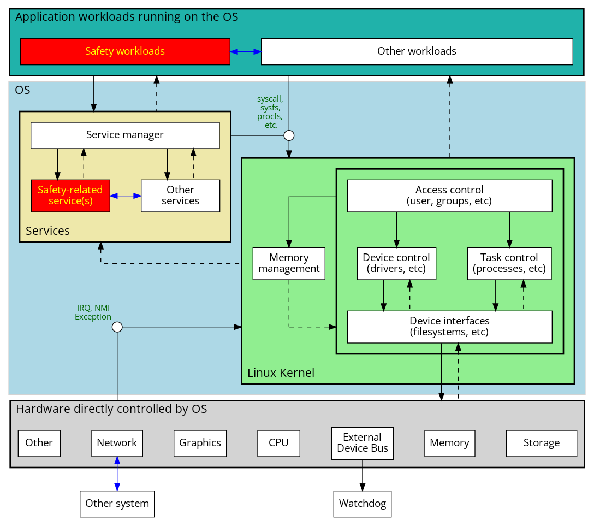

# Linux abstract architectural design model

This is an abstract architectural design model for Linux-based operating systems.

It shows a generic control structure for exploring the interactions between the OS components, hardware components and userspace applications running on the OS. This is intended to guide safety analysis focusing on specific applications or components at this level of abstraction, as informed by the results of e.g. STPA at a higher level, and to provide a consistent framework for creating a set of such diagrams.

* Boxes are an abstraction of a function, component or subsystem
  - Usually a logical role rather than a concrete component
* Red highlights show where safety-certified components may be included
* Solid black arrows indicate *control actions*
* Dashed black arrows indicate *feedback*
* Blue arrows indicate *information or data flow*
* Circles labelled in green are interface details for control actions

